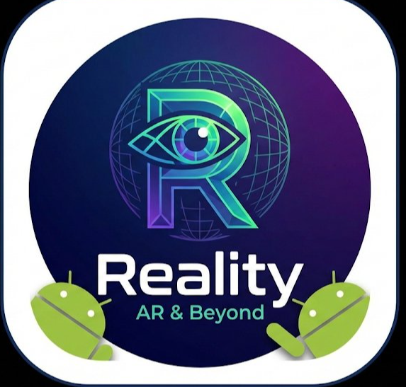

# Reality - Digital Wellbeing App

<p align="center">
  
</p>

<p align="center">
  <b>Take control of your digital life</b>
</p>

<p align="center">
  <a href="https://github.com/pawanwashudev-official/Reality/releases">
    
  </a>
  <a href="https://github.com/pawanwashudev-official/Reality/blob/main/LICENSE">
    
  </a>
</p>

---

## 📱 About

**Reality** is a powerful digital wellbeing app that helps you stay focused and reduce screen time. Block distracting apps and websites during focus sessions, schedules, or bedtime mode.

### Features

- 🎯 **Focus Mode** - Block distracting apps and websites during focus sessions
- 📅 **Scheduled Blocking** - Set up automatic focus times
- 🌙 **Bedtime Mode** - Limit late-night phone usage
- 🔒 **Website Blocking** - Block distracting websites across all browsers
- 📊 **Usage Tracking** - Monitor your screen time
- 🛡️ **Anti-Uninstall** - Prevent bypassing the app
- ⏱️ **App Limits** - Set daily time limits for apps

## 🚀 Getting Started

### Prerequisites

- Android Studio Arctic Fox or newer
- Android SDK 26+ (Android 8.0)
- JDK 8+

### Building

1. Clone the repository:
```bash
git clone https://github.com/pawanwashudev-official/Reality.git
```

2. Open in Android Studio

3. Create `local.properties` in the project root with your signing config:
```properties
sdk.dir=YOUR_SDK_PATH

# Signing (optional for debug builds)
KEYSTORE_FILE=path/to/your/keystore.jks
KEYSTORE_PASSWORD=your_password
KEY_ALIAS=your_key_alias
KEY_PASSWORD=your_key_password
```

4. Build the project:
```bash
./gradlew assembleDebug
```

## 📦 Download

Download the latest release from [GitHub Releases](https://github.com/pawanwashudev-official/Reality/releases).

## 🤝 Contributing

Contributions are welcome! Please feel free to submit a Pull Request.

## 📧 Contact & Support

- **Developer:** Pawan Washudev
- **Email:** pawanwashudev@gmail.com
- **GitHub:** [@pawanwashudev-official](https://github.com/pawanwashudev-official)
- **Telegram:** [@pawanwashudev](https://t.me/pawanwashudev)
- **Instagram:** [@pawanwashudev](https://instagram.com/pawanwashudev)

## 📄 Privacy Policy

Read our privacy policy at [realityprivicypolicy.vercel.app](https://realityprivicypolicy.vercel.app)

## 📜 License

This project is open source and available under the [MIT License](LICENSE).

---

<p align="center">
  Made with ❤️ in India by <a href="https://github.com/pawanwashudev-official">Neubofy</a>
</p>